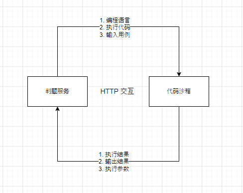

<a name="readme-top"></a>

<!-- PROJECT LOGO -->
<br />

<div align="center">
  <a href="https://github.com/sheldon-3601e">
    
  </a>

  <h3 align="center">DevLab - 个人学习网站</h3>

  <p align="center">
    基于 SpringBoot + Docker + React + And Design Pro 的全栈个人学习网站。提供了 推荐相似用户功能、建队组队功能、学习文章分析功能，在线刷题等功能。 其中自主实现的代码沙箱，提供了网络接口，可作为独立服务供其他开发者调用。
    <br />
    <br />
     <a href="https://github.com/sheldon-3601e/DevLab/tree/master/DevLab-backend"><strong>后端模块</strong></a>
    ·  
        <a href="https://github.com/sheldon-3601e/DevLab/tree/master/Devlab-code-sandbox">代码沙箱模块</a>
    ·
    <a href="https://github.com/sheldon-3601e/DevLab/tree/master/DevLab-frontend">前端模块</a>
  </p>
</div>


<!-- TABLE OF CONTENTS -->

<details>
  <summary>点我展开目录</summary>
  <ol>
    <li>
      <a href="#项目介绍">项目介绍</a>
      <ul>
        <li><a href="#前言">前言</a></li>
        <li><a href="#项目架构">项目架构</a></li>
        <li><a href="#模块介绍">模块介绍</a></li>
        <li><a href="#业务流程">业务流程</a></li>
      </ul>
    </li>
    <li>
      <a href="#技术栈">技术栈</a>
      <ul>
        <li><a href="#后端">后端</a></li>
        <li><a href="#前端">前端</a></li>
      </ul>
    </li>
    <li>
      <a href="#快速开始">快速开始</a>
      <ul>
        <li><a href="#前端模块">前端模块</a></li>
        <li><a href="#后端模块">后端模块</a></li>
      </ul>
    </li>
    <li><a href="#计划">计划</a></li>
  </ol>
</details>

<!-- ABOUT THE PROJECT -->

# 项目介绍

## 前言

本项目是基于 **缘聚匹配平台** 开发，如果想要了解项目中 用户模块、组队模块，请访问该[项目](https://github.com/sheldon-3601e/partner-match)

## /项目架构


## 模块介绍

1. 用户模块

	- 登录：提供分布式 Session 存储，保证集群用户登录的同步性。
	- 标签：用户添加对应的标签，通过 距离编辑算法 推荐用户。
	- 信息查看与修改: 用户可以查看和修改个人信息，以保持信息的准确性。

2. 组队模块

	- 创建队伍：用户可以创建自己的队伍，并指定对应参数，如最大人数、是否私有等
	- 加入和退出队伍：用户可以自主加入和退出队伍，队伍创建者可以转让队伍

3. 题目模块

	- 发布题目：整合 React-markdown 文档编辑器 提供更方便的用户体验。
	- 在线做题：整合 react-codemirror 代码编辑器， 支付用户在线做题。
	- 查看提交结果： 用户能够查看他们的题目提交结果，包括失败的原因。

4. 文章模块

	- 查看文章：提供用户浏览系统内发布的文章的功能。
	- 点赞收藏文章：用户可以为喜欢的文章点赞或者收藏，以后日后学习。

## 业务流程

### 题目提交


### 设计模式

因为在线判题系统的功能较为复杂，所以采用了多种设计模式。


- 采用 静态工厂模式 和 Spring 配置 化方式实现了对多种代码沙箱的灵活调用。
- 通过 代理模式 增强了代码沙箱接口的能力，统一实现了对调用前后的日志记录。
- 利用 策略模式 独立封装了不同语言的判题算法，提高系统的可维护性和扩展性。

为了更直观的体现 设计模式 在业务流程中的作用，制作了以下图


## 特别说明

本项目为了 代码沙箱 成为了一个可以独立对外提供服务的模块，所以将代码沙箱抽离出来
在后端模块中，与代码沙箱进行交互的是判题服务
为了防止功能上的混淆，用以下图说明 代码沙箱 和 判题服务 的关系

<div align="center">
    
</div>

<p align="right">(<a href="#readme-top">back to top</a>)</p>

# 技术栈
## 后端

- Spring Boot + SpringMVC 框架
- MySQL 数据库、
- Mybatis-Plus 及 mybatis X 自动生成
- Redis 分布式登录及缓存
- Redisson 分布式锁和限流机制
- 相似匹配度算法
- Java 安全管理器
- Docker 代码沙箱实现
- 虚拟机 + 远程开发
- 多种设计模式：工厂模式、代理模式、策略模式、模板模式
- Easy Excel处理工具
- Swagger + Knife4j 接口文档
- Hutool、Apache Common Utils 等工具库

## 前端

- React 18
- Ant Design Pro 5.x 脚手架
- Umi 4前端框架
- Ant Design 组件库
- OpenAPI 前端代码生成
- React-markdown 文档编辑器
- react-codemirror 代码编辑器


<!-- GETTING STARTED -->
# 快速开始

首先你需要确保你的版本号

- Jdk：1.8
- Node.js：18.16.0
- npm：9.5.1
- Redis：3.2.100

## 前端模块

你需要下载完整文件，并在根目录执行安装依赖，推荐使用 npm 安装.
  ```sh
  npm install
  ```

## 后端模块

你需要分别下载 后端模块 和判题模块。
先启动 Redis，然后开启代码沙箱模块，最后开启 后端模块

<p align="right">(<a href="#readme-top">back to top</a>)</p>

<!-- ROADMAP -->

## 计划

- [ ] 添加网络通信功能
	- [ ] 用户私聊
	- [ ] 队伍群聊
- [ ] 完善题目模块
	- [ ] 添加题目表单
	- [ ] 添加答题排名
	- [ ] 添加竞赛功能

<p align="right">(<a href="#readme-top">back to top</a>)</p>
